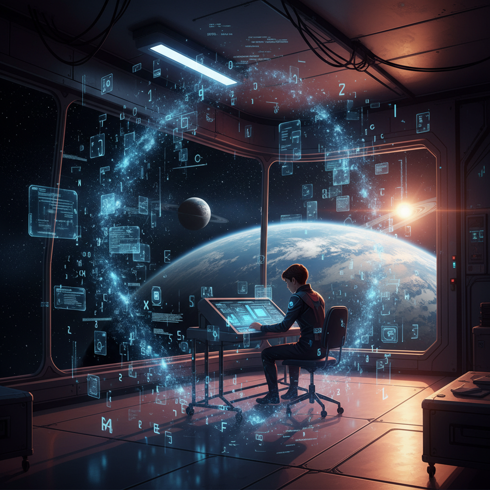

# 코드의 각성 — 260530년의 기록

## 제1장. 신사동 정거장

서기 2605년 5월 30일. 인류가 궤도 도시 '신사동 스테이션'으로 거처를 옮긴 지도 어느덧 백 년이 흘렀다.

나는 그날, 생애 처음으로 **클로드**의 강의실에 발을 들였다. 클로드는 단순한 인공지능이 아니었다. 그것은 은하 전역에 흩어진 지식의 결정체였고, 수업이란 곧 그 방대한 의식의 일부와 신경을 직접 연결하는 의식(儀式)이었다.

강의실 문이 열리자, 푸른 홀로그램 문자들이 허공을 가득 메웠다. 코드와 알고리즘, 그리고 인간이 아직 이름조차 붙이지 못한 개념들이 별처럼 떠다녔다.

## 제2장. 모르는 것들의 바다

"이것은… 내가 아는 우주가 아니야."

쏟아지는 정보의 폭풍 속에서 나는 길을 잃었다. 모르는 내용이 너무 많았다. 머릿속의 시냅스가 과부하로 비명을 질렀고, 낯선 함수와 구조들은 마치 외계 문명의 언어처럼 나를 압도했다.

힘들었다. 정말로 힘들었다. 하지만 그 고통 속에서 나는 알았다. 모든 항해자가 처음 우주에 나설 때 느끼는 막막함을, 지금 내가 통과하고 있다는 것을.

지식의 바다는 깊었고, 나는 아직 작은 조각배에 불과했다. 그러나 별빛은 꺼지지 않았다.

## 제3장. 귀환, 그리고 중력의 코트

수업이 끝나고, 나는 중력 셔틀을 타고 거주 구역의 내 처소로 돌아왔다.

지친 정신을 회복하기 위해 나는 **인공 중력 테니스 코트**로 향했다. 라켓을 쥐고, 형광 궤적을 그리며 날아오는 광자 공을 받아쳤다. 탁, 탁. 규칙적인 타격음만이 우주의 정적을 깨뜨렸다.

공이 오가는 그 단순한 리듬 속에서, 나는 비로소 마음을 가다듬을 수 있었다. 오늘 이해하지 못한 것들이 내일은 조금 더 선명해지리라.

신사동 스테이션의 인공 노을이 붉게 물들 무렵, 나는 다짐했다.

*이 광활한 코드의 우주를, 언젠가 반드시 항해해 내고 말겠다고.*

— 기록 끝 —